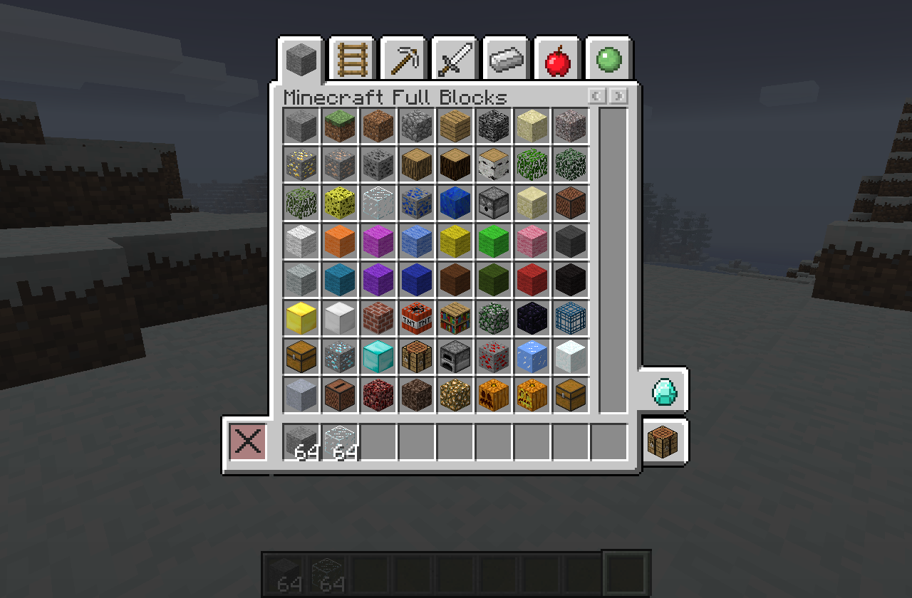
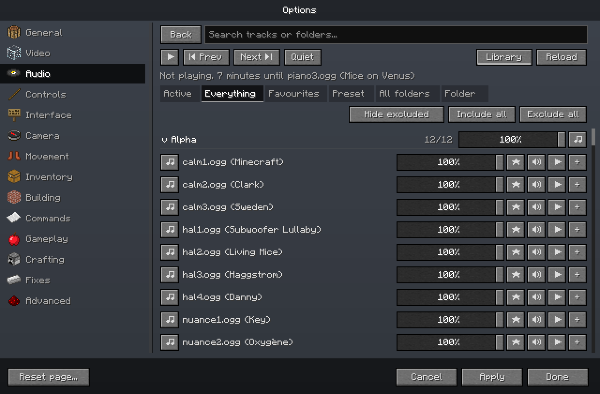
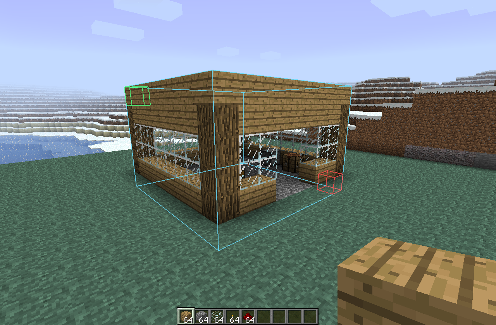
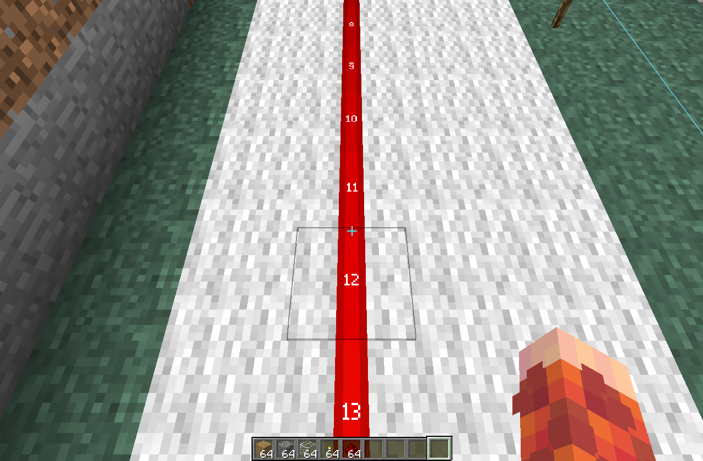
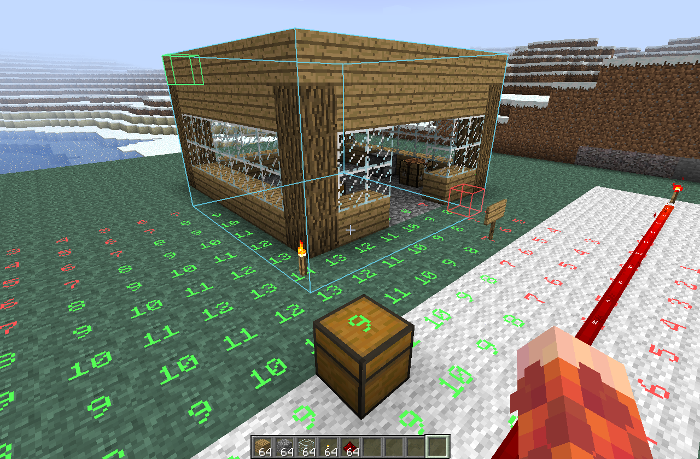
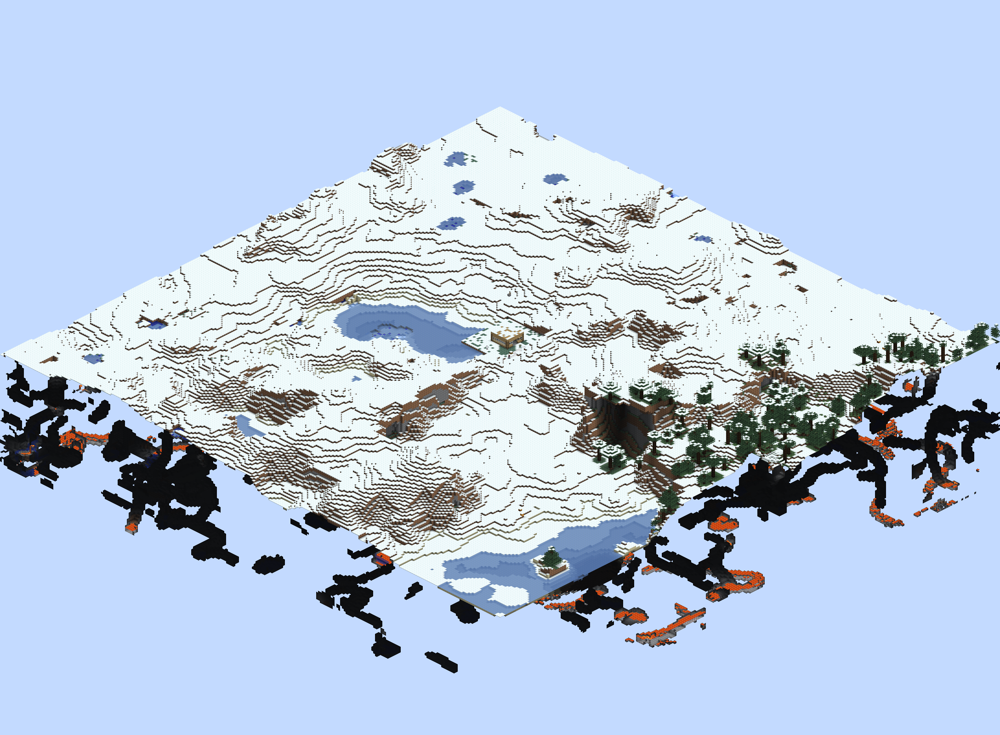

# Power Beta

Minecraft Beta 1.7.3 with one searchable Options menu for fixes, better controls,
building tools and creative play. Keep Beta's gameplay or tune it to suit you.
Built for singleplayer.

[Website and download](https://power-beta-gamma.vercel.app/)

| Creative inventory | Music library |
| --- | --- |
| [](docs/screenshots/creative-inventory.png) | [](docs/screenshots/music-library.png) |

| WorldEdit | Redstone power levels |
| --- | --- |
| [](docs/screenshots/worldedit.png) | [](docs/screenshots/redstone.png) |

| Light levels | Isometric screenshots |
| --- | --- |
| [](docs/screenshots/light-levels.png) | [](docs/screenshots/isometric.png) |

## What's included

- Vanilla Beta mechanics by default, with optional bug fixes and modern conveniences.
- Performance improvements and detailed control over graphics and game mechanics.
- Flexible key bindings, modifier shortcuts and movement while inventories are open.
- Separate sound controls, custom music, playlists and saved presets.
- Optional faster boats, minecarts and obsidian mining.
- Optional modern water landings and water bucket clutches, including flowing water.
- Editable signs and useful gold tools, including silk touch.
- Creative and spectator modes with a modern mode switcher.
- Backported WorldEdit and singleplayer commands with modern Minecraft syntax.
- Customizable crafting recipes and container carrying.
- Building aids including fast placement, light levels, container previews,
  edge protection and auto-walk.
- Free camera, free look and isometric screenshots.
- Texture options for old cobblestone, old bricks and redstone power numbers.

Most gameplay changes start off. Fixes, performance improvements and small
conveniences start on. Each world has its own Cheats switch for creative modes,
commands and world editing. Other settings are shared unless marked "this world".

## Install

1. Install [Prism Launcher](https://prismlauncher.org/) and add your Minecraft account.
2. [Download the Prism ZIP](https://power-beta-gamma.vercel.app/download). If you have the source code
   instead, build that ZIP using the steps below.
3. In Prism, choose **Add Instance > Import**, then select the ZIP.
4. Open the instance's **Edit > Settings > Java**, enable the Java installation
   override and select **Java 21**. Download Java through Prism if needed.
5. Launch the instance. Open **Options** to browse or search settings and hover
   them for help. **Apply** saves changes; **Cancel** discards them.

The pack includes all required mods. Import the whole ZIP into a new instance.
Back up your worlds before replacing an existing installation.

## Build the ZIP from source

1. Install Java 21 and Python 3.
2. Download this repository with **Code > Download ZIP** and extract it, or clone it.
3. Open a terminal in the extracted folder. Set `JAVA_HOME` to your Java 21
   installation, then run:

   ```sh
   python3 tools/build_pack.py
   ```

4. Import the resulting `dist/Power-Beta-<version>-Prism.zip` into Prism as described above.

Development and update instructions are in [AGENTS.md](AGENTS.md). See
[releases](docs/releases.md) for publishing and [recovery](docs/recovery.md)
for inventory recovery. [Chat and WorldEdit](docs/commands.md) covers editing,
completion and block states. Changes are listed in the [changelog](CHANGELOG.md)
and [GitHub releases](https://github.com/lpke/mc-power-beta/releases).

Power Beta is maintained by its owner and does not accept contributions.
You are welcome to fork it and adapt it to your needs under the AGPL license.

## Inspired by

[BHCreative](https://github.com/paulevsGitch/BHCreative),
[Tweakeroo](https://github.com/maruohon/tweakeroo),
[WorldEdit](https://github.com/EngineHub/WorldEdit),
[Better Than Adventure](https://github.com/Better-than-Adventure),
[OmniLook](https://github.com/rhysdh540/Omnilook),
[UniTweaks](https://github.com/danygames2014/UniTweaks),
[StationAPI utilities](https://github.com/telvarost),
[Light Overlay](https://github.com/shedaniel/LightOverlay) and
[Click Mining Forever](https://github.com/snowtyler/click-mining-forever).

[AGPL-3.0-only](LICENSE). This is not an official Minecraft product.
